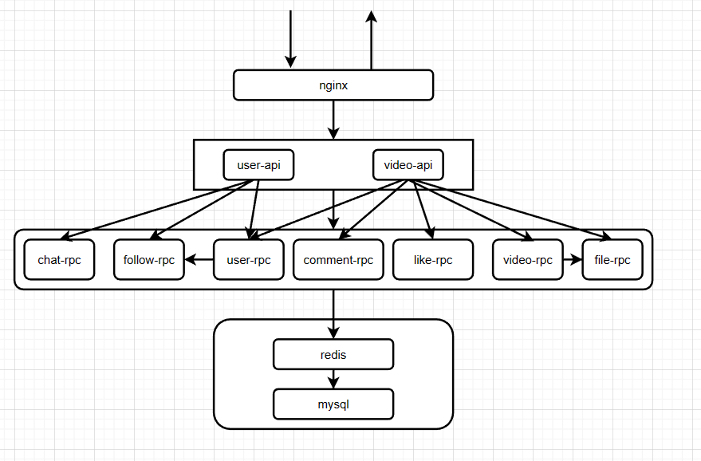

## 功能介绍

- 视频：视频推送、视频投稿、发布列表
- 用户：用户注册、用户登录、用户信息
- 点赞：点赞操作、点赞列表
- 评论：评论操作、评论列表
- 关注：关注操作、关注列表、粉丝列表、好友列表、好友最新消息
- 聊天：聊天操作、聊天记录

## 项目部署

安装`docker`和`docker-compose`

- git clone https://github.com/qingmeng123/tik-tok-brief.git
- 配置各个etc下的yaml文件
- 使用`docker-compose build`将六个服务构建，再使用`docker-compose up -d`启动服务

## 接口文档
见resource文件夹

## 主要技术
本项目采用基于`go-zero`的RPC框架，包含了`go-zero`以及相关`go-zero`作者开发的一些中间件，所用到的技术栈基本是`go-zero`
项目组的自研组件。
- Go-zero
- Mysql
- Redis
- grpc

### 其他组件
- COS
- nginx
- prometheus
- grafana
- DTM
- jaeger
- logx
- golang-jwt
- sonyflake
- ffmpeg-go
- jinzhu/copier 

## 调用关系

不同的请求通过nginx反向代理到不同的api服务中，api调用多个rpc服务，rpc连接各自的数据库，雪花算法生成id便于分库分表。
采用DTM SAGA事务模式对api对多个微服务进行分布式事务处理，保证数据一致性。

## 目录结构
```

├─common    //公用包
│  ├─errorx
│  ├─middleware
│  ├─response
│  ├─snowflake
│  └─tool
├─deploy    //依赖
│  ├─nginx
│  │  └─conf.d
│  └─sql
│      └─init
├─resource  
├─service   //所有api和rpc服务
│  ├─chat
│  │  ├─model
│  │  └─rpc
│  │      ├─chat
│  │      ├─etc
│  │      ├─internal
│  │      │  ├─config
│  │      │  ├─logic
│  │      │  ├─server
│  │      │  └─svc
│  │      ├─logs
│  │      └─proto
│  │          └─pb
│  ├─comment
│  │  ├─model
│  │  └─rpc
│  │      ├─comment
│  │      ├─etc
│  │      ├─internal
│  │      │  ├─config
│  │      │  ├─logic
│  │      │  ├─server
│  │      │  └─svc
│  │      └─proto
│  │          └─pb
│  ├─dtm
│  ├─file
│  │  └─rpc
│  │      ├─etc
│  │      ├─file
│  │      ├─internal
│  │      │  ├─config
│  │      │  ├─logic
│  │      │  ├─server
│  │      │  └─svc
│  │      ├─logs
│  │      ├─proto
│  │      │  └─pb
│  │      └─static
│  │          └─video
│  ├─follow
│  │  ├─model
│  │  └─rpc
│  │      ├─etc
│  │      ├─follow
│  │      ├─internal
│  │      │  ├─config
│  │      │  ├─logic
│  │      │  ├─server
│  │      │  └─svc
│  │      ├─logs
│  │      └─proto
│  │          └─pb
│  ├─like
│  │  ├─model
│  │  └─rpc
│  │      ├─etc
│  │      ├─internal
│  │      │  ├─config
│  │      │  ├─logic
│  │      │  ├─server
│  │      │  └─svc
│  │      ├─like
│  │      └─proto
│  │          └─pb
│  ├─prometheus
│  ├─user
│  │  ├─api
│  │  │  ├─etc
│  │  │  ├─internal
│  │  │  │  ├─config
│  │  │  │  ├─handler
│  │  │  │  │  └─chat
│  │  │  │  ├─logic
│  │  │  │  │  └─chat
│  │  │  │  ├─middleware
│  │  │  │  ├─svc
│  │  │  │  └─types
│  │  │  └─logs
│  │  ├─model
│  │  └─rpc
│  │      ├─etc
│  │      ├─internal
│  │      │  ├─config
│  │      │  ├─logic
│  │      │  ├─server
│  │      │  └─svc
│  │      ├─logs
│  │      ├─proto
│  │      │  └─pb
│  │      └─user
│  └─video
│      ├─api
│      │  ├─etc
│      │  └─internal
│      │      ├─config
│      │      ├─handler
│      │      ├─logic
│      │      ├─middleware
│      │      ├─svc
│      │      └─types
│      ├─model
│      └─rpc
│          ├─etc
│          ├─internal
│          │  ├─config
│          │  ├─logic
│          │  ├─server
│          │  └─svc
│          ├─proto
│          │  └─pb
│          └─video
└─sql


```